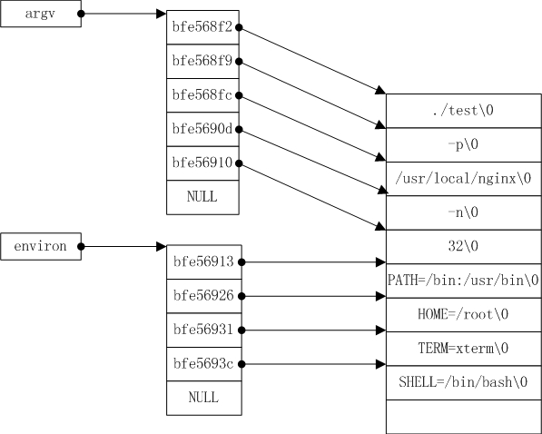

# 如何修改进程名称

https://blog.csdn.net/tycoon1988/article/details/39082487

## 命令行参数

每一个C程序都有个main函数，作为程序启动入口函数。main函数的原型是`int main(int argc , char *argv[])`，其中argc表示命令行参数的个数；
argv是一个指针数组，保存所有命令行字符串。Linux进程名称是通过命令行参数argv[0]来表示的。

## 环境变量参数

Linux 还有环境变量参数信息，表示进程执行需要的所有环境变量信息。

通过全局变量`char **environ`可以访问环境变量。

## argv和environ的内存布局



命令行参数argv和环境变量信息environ是在一块连续的内存中表示的，并且environ紧跟在argv后面。

**验证argv和environ执行连续内存的测试程序：**

```c
#include <stdio.h>

extern char **environ;
int main(int argc , char *argv[])
{
   int i;
   printf("argc:%d\n" , argc);
   for (i = 0; i < argc; ++i){
       printf("%p\n" , argv[i]);
       printf("argv[%d]:%s\n" , i , argv[i]);
    }
   printf("evriron=%p\n" , environ[0]);
   return 0;
}
```

```shell
$ gcc test.c -o test
$ ./test hello world
argc:3
7fff57d61730
argv[0]:./a.out
7fff57d61738
argv[1]:hello
7fff57d6173e
argv[2]:world
evriron=7fff57d61744
```

## 修改进程名称

按理说，修改进程名称，只需要修改argv[0]指向的内存的值为所需要的值即可。但是当我们要修改的值超过argv[0]所指向的内存空间大小时，再这样直接修改，就会覆盖掉一部分argv[1]的值，因为从上面的图中，很容易就可以看出。

这时候，该怎么做呢？
- 1、必须重新分配一块连续的内存空间，把argv和environ的参数都复制到新的空间。
- 2、修改argv[0]为所需要修改的值。

## Nginx实现

TODO

## Redis实现

https://github.com/antirez/redis/blob/3.0/src/setproctitle.c 

`setproctitle.c`文件提供了如下几个方法：
* spt_init(): https://github.com/antirez/redis/blob/3.0/src/setproctitle.c#L148
* spt_clearenv()：https://github.com/antirez/redis/blob/48e24d54b736b162617112ce27ec724b9290592e/src/setproctitle.c#L79
* spt_copyenv()：https://github.com/antirez/redis/blob/48e24d54b736b162617112ce27ec724b9290592e/src/setproctitle.c#L99
* spt_copyargs()：https://github.com/antirez/redis/blob/48e24d54b736b162617112ce27ec724b9290592e/src/setproctitle.c#L130
* setproctitle(): https://github.com/antirez/redis/blob/3.0/src/setproctitle.c#L216 

修改进程名称方法的调用是在`redis.c`文件中：
* 调用spt_init()：https://github.com/antirez/redis/blob/3.0/src/redis.c#L3601
* 调用setproctitle()：https://github.com/antirez/redis/blob/3.0/src/redis.c#L3586 

#### spt_init()

TODO

#### setproctitle()

TODO

